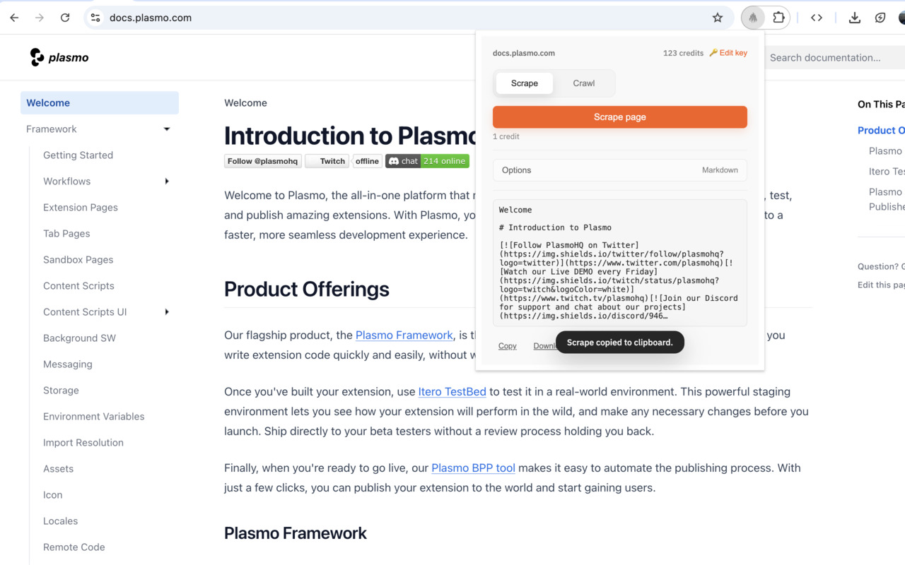

# Fireclaw - Firecrawl Browser Extension

A browser extension that lets you quickly scrape or crawl websites using [Firecrawl](https://firecrawl.dev). Extract content in Markdown, HTML, JSON, or other formats with a single click.



## Features

- **Scrape**: Extract content from the current page in multiple formats
- **Crawl**: Crawl entire websites with configurable depth and options
- **Multiple Formats**: Markdown, HTML, JSON, Links, and Summary
- **Auto-copy & Download**: Content automatically copied to clipboard or downloaded
- **Credit Tracking**: Real-time display of your Firecrawl API credits
- **Customizable Options**: Control crawl depth, concurrency, path filtering, and more

## Setup

### Prerequisites

- Node.js (v16 or higher)
- A [Firecrawl API key](https://firecrawl.dev)

### Installation

1. **Clone the repository**
   ```bash
   git clone https://github.com/MaskyS/fireclaw.git
   cd fireclaw
   ```

2. **Install dependencies**
   ```bash
   npm install
   ```

3. **Start development mode**
   ```bash
   npm run dev
   ```

4. **Load the extension in your browser**
   - **Chrome/Edge**: Navigate to `chrome://extensions/`, enable "Developer mode", click "Load unpacked", and select the `build/chrome-mv3-dev` directory
   - **Firefox**: Navigate to `about:debugging#/runtime/this-firefox`, click "Load Temporary Add-on", and select any file in the `build/firefox-mv3-dev` directory

5. **Add your Firecrawl API key**
   - Click the extension icon
   - Enter your API key in the input field
   - Click "Save"

## Usage

### Scrape Mode
1. Click the extension icon on any webpage
2. Configure output formats in the Options section (Markdown is selected by default)
3. Click "Scrape page" to extract content
4. Content is automatically copied to your clipboard and shown in the preview

### Crawl Mode
1. Switch to the "Crawl" tab
2. Configure crawl options:
   - **Prompt**: Optional AI prompt to guide extraction
   - **Max pages**: Limit number of pages to crawl
   - **Max depth**: How deep to follow links
   - **Include/Exclude paths**: Filter which pages to crawl
3. Click "Start crawl" to begin
4. Crawl results are automatically downloaded as JSON when complete

## Build for Production

```bash
# Build the extension
npm run build

# Package the extension (creates a zip file)
npm run package
```

The production build will be in the `build/chrome-mv3-prod` directory.

## Tech Stack

- [Plasmo](https://www.plasmo.com/) - Browser extension framework
- React 19 with TypeScript
- TanStack Query - Data fetching and state management
- Firecrawl API v2

## Project Structure

```
src/
├── popup/          # Extension popup UI
├── background/     # Background scripts and message handlers
├── lib/            # Core utilities (Firecrawl API, storage, downloads)
└── assets/         # Icons and images
```

## License

MIT
